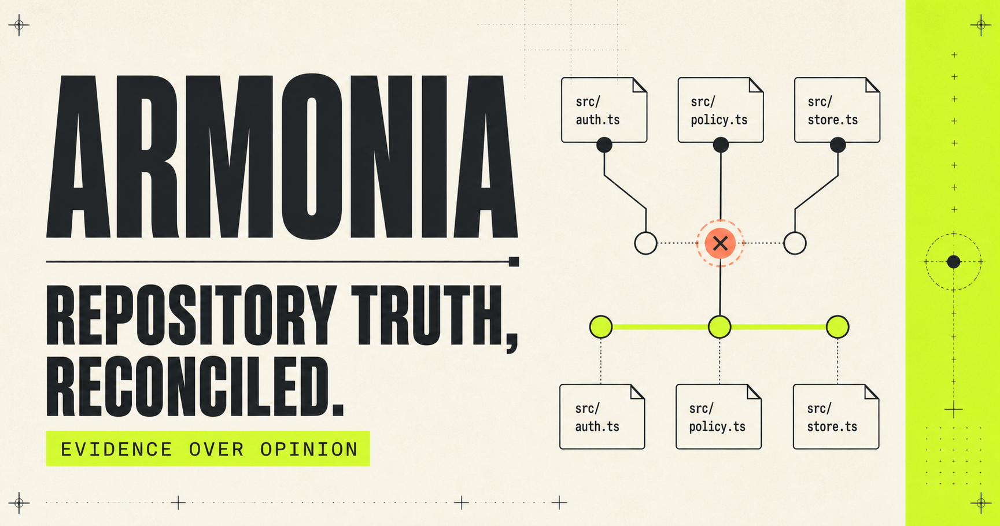

<p align="center">
  
</p>

<p align="center">
  <strong>Repository truth, reconciled.</strong><br />
  An offline evidence engine for the promises scattered across a software repository.
</p>

<p align="center">
  <a href="LICENSE"></a>
  
  
  
</p>

> [!TIP]
> Armonia does not ask which file is right. It shows you the evidence when two files cannot both be right.

## Why Armonia exists

Repositories drift in the gaps between valid files. A README can be accurate on
its own while CI, environment examples, package metadata, and deployment files
quietly tell a different story.

| A conventional linter asks | Armonia asks |
| --- | --- |
| Is this file valid? | Do these files agree? |
| Does this syntax type-check? | Does the documented command still exist? |
| Is this workflow well-formed? | Does the workflow use the runtime the project promises? |

Armonia collects source-located claims, reconciles claims that describe the
same intent, and emits findings with both witnesses. The result is a durable
review artifact rather than a vague warning.

```text
README.md          →  declared runtime
.github/ci.yml     →  stale runtime
package.json       →  declared range
                         │
                         └── runtime/node-drift
                             Both declarations are shown. Armonia never guesses the winner.
```

## What it verifies

| Surface | Examples |
| --- | --- |
| Documentation | broken relative links, stale commands, missing README |
| Runtime | Node-version and local-port drift across docs, CI, manifests, containers |
| Delivery | invalid manifests, missing entrypoints, conflicting lockfiles, absent tests or CI |
| Environment | source variables missing from `.env.example`, stale example variables |
| Security posture | mutable workflow refs, implicit workflow permissions, floating images, possible secret shapes |
| Public readiness | license, contribution guide, security policy, code of conduct |

Every finding has a stable fingerprint and can be rendered as terminal text,
JSON, or SARIF for code-scanning and review systems.

## Quick start

**Prerequisite:** Node.js `>=22.13.0`.

```bash
git clone <your-clone-url>
cd armonia
npm ci --ignore-scripts
npm run check
```

Scan any repository without executing its code:

```bash
node bin/armonia.mjs scan /path/to/repository
```

Or scan the current directory from an Armonia checkout:

```bash
npm run scan
```

The scanner exits with code `1` when a finding reaches the configured threshold
(`error` by default), making it safe to use as a CI gate.

## Output that carries its evidence

```bash
# Machine-readable report; absolute local paths stay out by default.
node bin/armonia.mjs scan . --format json --output artifacts/armonia.json

# SARIF for compatible code-scanning and review tooling.
node bin/armonia.mjs scan . --format sarif --output artifacts/armonia.sarif

# Keep the report informative without failing a local exploration.
node bin/armonia.mjs scan . --fail-on never
```

```text
ARMONIA  example-project
92/100 · grade A- · 137 claims · 1 contradiction

× ERROR  Runtime declaration disagrees across sources
  runtime/node-drift · The project promises two incompatible runtimes.
  ↳ package.json:12  declared runtime range
  ↳ .github/workflows/ci.yml:18  stale runtime declaration
  fix: Choose one supported runtime and update every declaration.
```

## Add a visible contract only when you need one

Armonia works with zero configuration. To create a reviewable contract for a
repository, initialize a configuration file:

```bash
node bin/armonia.mjs init .
node bin/armonia.mjs scan . --config armonia.config.json
```

```json
{
  "$schema": "./schema/armonia.schema.json",
  "failOn": "error",
  "exclude": ["fixtures/**", "generated/**"],
  "rules": { "disable": [] }
}
```

Exceptions belong in configuration, never in undocumented suppression comments.
That keeps every trade-off visible in code review.

## Portfolio mode, without portfolio leakage

Armonia can aggregate only the metadata and scores you deliberately list in a
registry. It does not publish source text or evidence from other repositories.
Start from the self-contained [example registry](examples/portfolio/registry.json):

```bash
node bin/armonia.mjs portfolio \
  --registry examples/portfolio/registry.json \
  --output .armonia/portfolio-snapshot.json
```

Review any generated snapshot before committing it. A portfolio report can
contain repository names, scores, paths relative to the registry, and other
metadata you chose to include.

## Privacy and threat model

The core engine is deterministic and local-first:

- it makes no network requests and executes no discovered repository files or commands;
- it does not follow symbolic links and bounds traversal and text-file size;
- it redacts high-confidence credential-shaped values before a finding is stored or rendered;
- it writes output only when you explicitly pass `--output`.

Reports may still contain filenames, line numbers, environment-variable names,
and project metadata. Treat reports as review artifacts and inspect them before
sharing. Read the full [security policy](SECURITY.md) and
[privacy notes](docs/privacy.md).

## Development

```bash
npm ci --ignore-scripts
npm run lint
npm test
npm run build
npm run test:site
npm run check
```

`npm run check` is the public-release gate: lint, deterministic core tests,
production build, rendered-site test, and a self-scan must all succeed.

## Release posture

Armonia is an early public preview. Its JSON report contract is versioned;
rules may evolve before `1.0`. Before tagging a release, follow
[RELEASING.md](RELEASING.md), run the clean-environment gate, inspect the npm
package contents with `npm pack --dry-run`, and enable GitHub private
vulnerability reporting on the repository.

## Documentation

- [Architecture](docs/architecture.md)
- [Rule catalog](docs/rules.md)
- [Privacy notes](docs/privacy.md)
- [Contributing](CONTRIBUTING.md)
- [Security policy](SECURITY.md)
- [Changelog](CHANGELOG.md)

## License

[MIT](LICENSE) © Armonia contributors.
