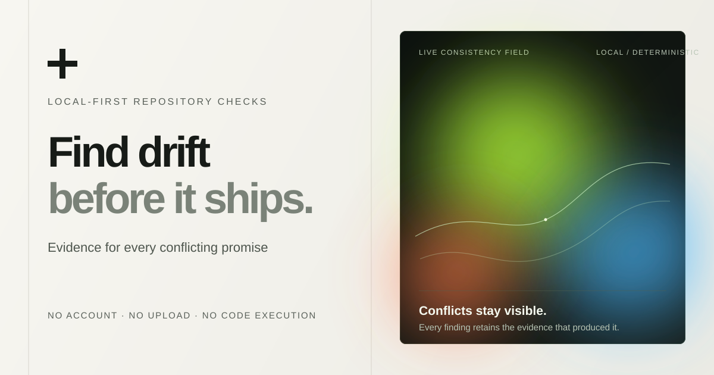

<p align="center">
  
</p>

<h1 align="center">Armonia</h1>

<p align="center">
  <strong>Find repository drift before it ships.</strong><br />
  Local-first consistency checks for the promises scattered across a software repository.
</p>

<p align="center">
  <a href="https://github.com/AleDet01/Armonia/actions/workflows/ci.yml"></a>
  <a href="LICENSE"></a>
  
</p>

<p align="center">
  <a href="https://AleDet01.github.io/Armonia/">Live demo</a> ·
  <a href="docs/rules.md">Rules</a> ·
  <a href="docs/privacy.md">Privacy</a> ·
  <a href="CONTRIBUTING.md">Contributing</a>
</p>

<p align="center">
  
</p>

Armonia does not choose which file is right. It reports the declarations that
disagree, their exact source locations, and a stable finding for code review or
CI. A valid README, workflow, container and manifest can still contradict each
other; Armonia checks the relationships between them.

## What it checks

| Surface | Examples |
| --- | --- |
| Documentation | missing README, broken relative links, commands that do not exist |
| Runtime | Node major and local-port drift across docs, CI, manifests and Docker |
| Delivery | invalid manifests, missing entrypoints, conflicting lockfiles, absent CI or test scripts |
| Environment | undocumented or stale example variables |
| Security posture | mutable Action refs, implicit workflow permissions, floating images, credential-shaped values |
| Community readiness | license, contribution guide, security policy and code of conduct |

## Quick start

Requires Node.js 22.13 or newer.

```bash
git clone https://github.com/AleDet01/Armonia.git
cd Armonia
npm ci --ignore-scripts
node bin/armonia.mjs scan .
```

Use `--fail-on never` for an exploratory local run. By default, the CLI exits
with code `1` when it finds an error-level issue—safe for a CI gate.

```bash
# A portable report for review or automation
node bin/armonia.mjs scan . --format json --output artifacts/armonia.json

# Native findings for compatible code-scanning tools
node bin/armonia.mjs scan . --format sarif --output artifacts/armonia.sarif
```

## Browser demo

Run `npm run dev`, then choose a repository folder in a Chromium-based browser.
The demo reads supported text files locally, never uploads them, and does not
execute repository code. Use the CLI for the complete, repeatable check in CI.

## Privacy and scope

The scanner makes no network requests, does not follow symbolic links, bounds
file traversal and text size, and redacts high-confidence credential-shaped
values before a finding is stored or printed. Reports can still contain relative
paths, line numbers and project metadata: review them before sharing.

Armonia is an early `0.x` project. It surfaces evidence; maintainers decide
which declaration to change. Read the full [threat model](docs/privacy.md) and
[rule catalog](docs/rules.md) before enforcing it in production.

## Deploy and contribute

The live demo is a static GitHub Pages export. Each push to `main` runs tests,
audits dependencies, and publishes the verified `dist/client` artifact. The
workflow uses least-privilege permissions and pins third-party Actions to
immutable commits; Dependabot maintains dependencies and Actions weekly.

```bash
npm run check
```

See [CONTRIBUTING.md](CONTRIBUTING.md), [SECURITY.md](SECURITY.md),
[RELEASING.md](RELEASING.md), and [CHANGELOG.md](CHANGELOG.md) for the project
contract and release process.

## License

[MIT](LICENSE) © Armonia contributors.
